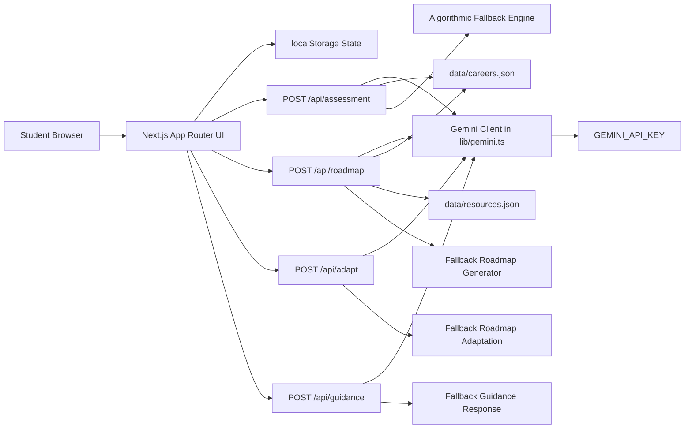

# EduFuture


AI-powered education and career-readiness platform built with Next.js. EduFuture helps students diagnose skill gaps, generate adaptive learning roadmaps, and receive contextual AI mentoring for future technology careers.

## Table of Contents

- [Overview](#overview)
- [Core Features](#core-features)
- [Product Flow](#product-flow)
- [Architecture](#architecture)
- [Tech Stack](#tech-stack)
- [Project Structure](#project-structure)
- [Getting Started](#getting-started)
- [Environment Variables](#environment-variables)
- [Available Scripts](#available-scripts)
- [API Reference](#api-reference)
- [API Curl Examples](#api-curl-examples)
- [Data and Domain Models](#data-and-domain-models)
- [State and Persistence](#state-and-persistence)
- [Build and Deployment Notes](#build-and-deployment-notes)
- [Troubleshooting](#troubleshooting)
- [Contributing](#contributing)

## Overview

EduFuture combines:

- AI-based student assessment
- Structured skill-gap diagnosis
- Personalized multi-stage roadmap generation
- Dynamic roadmap adaptation
- Career-oriented guidance chat

The application uses a hybrid strategy:

- Primary path: Gemini API via server-side route handlers
- Fallback path: deterministic local logic when AI is unavailable

This design keeps critical user flows functional even without API access.

## Core Features

1. Student Onboarding and Assessment
- Collects profile data, current skills, interests, and available study time.
- Generates readiness score, strengths, weaknesses, and prioritized skill gaps.

2. Personalized 5-Stage Learning Roadmap
- Produces staged progression from foundations to advanced/capstone outcomes.
- Includes topics, estimated hours, projects, deliverables, and resource links.

3. Adaptive Roadmap Updates
- Rebalances roadmap stages from user feedback (time changes, struggles, acceleration, focus shift).
- Preserves completed work while updating pending learning plan.

4. Guidance Chat
- Provides contextual mentor responses using profile, assessment, roadmap stage, and recent chat history.
- Returns follow-up prompts to guide next learning actions.

5. Career Explorer and Dashboard
- Supports exploring target careers and navigating progression through a student dashboard.

6. Local Persistence
- Saves profile, assessment, roadmap, and chat state in browser localStorage.

## Product Flow

1. User starts assessment from landing page.
2. Frontend posts profile to /api/assessment.
3. Assessment result is stored locally.
4. Frontend posts profile plus assessment to /api/roadmap.
5. Roadmap is rendered and tracked as progress updates.
6. User can request adaptation through /api/adapt.
7. User asks guidance questions through /api/guidance.

## Architecture



## Tech Stack

- Framework: Next.js 15 (App Router)
- Language: TypeScript
- UI: React 19 + Tailwind CSS 4
- Animation: motion
- AI SDK: @google/genai
- Linting: ESLint 9 + eslint-config-next
- Build output: standalone

## Project Structure

```text
app/
  api/
    adapt/route.ts
    assessment/route.ts
    guidance/route.ts
    roadmap/route.ts
  globals.css
  layout.tsx
  page.tsx
components/
  about/
  careers/
  dashboard/
  guidance/
  landing/
  layout/
  onboarding/
  roadmap/
data/
  careers.json
  resources.json
  skills.json
hooks/
lib/
  gemini.ts
  sample-data.ts
  storage.ts
  types.ts
scripts/
  generate-assets.js
```

## Getting Started

### Prerequisites

- Node.js 20 or later (recommended)
- npm 10 or later (recommended)

### Installation

```bash
npm install
```

### Development Server

```bash
npm run dev
```

Default local URL:

- http://localhost:3000

### Production Build

```bash
npm run build
npm run start
```

## Environment Variables

Create a local environment file from the example:

```bash
copy .env.example .env.local
```

Required variables:

- GEMINI_API_KEY
  - Required for Gemini-powered responses.
  - If missing, API routes fall back to local algorithmic behavior.

Optional/runtime variable:

- APP_URL
  - Useful for self-referential links and callback-style integrations.

Optional development variable:

- DISABLE_HMR=true
  - Disables watch behavior in dev through custom webpack watchOptions logic.

## Available Scripts

- npm run dev
  - Starts Next.js development server.

- npm run build
  - Creates optimized production build and performs type checking.

- npm run start
  - Starts production server from build output.

- npm run lint
  - Runs ESLint across project files.

- npm run clean
  - Currently mapped to next clean. Verify compatibility with your Next.js version before use.

## API Reference

All API routes are defined in app/api and accept JSON.

### POST /api/assessment

Purpose:

- Generate readiness diagnosis from student profile.

Request body:

```json
{
  "profile": {
    "id": "student-1",
    "fullName": "Student Name",
    "educationLevel": "Undergraduate (3rd/4th Year)",
    "major": "Computer Science",
    "currentYearOrSemester": "6th Semester",
    "careerGoalId": "ai-engineer",
    "careerGoalTitle": "AI Engineer",
    "currentSkills": [{ "name": "Python", "category": "Programming", "level": 6, "proficiency": "Intermediate" }],
    "interests": ["Machine Learning"],
    "currentExperience": "Built course projects",
    "weeklyAvailableHours": 12,
    "createdAt": "2026-01-01T00:00:00.000Z",
    "updatedAt": "2026-01-01T00:00:00.000Z"
  }
}
```

Response highlights:

- readinessScore
- strengths
- potentialWeaknesses
- skillGaps (priority, target level, recommended first topic)
- estimatedTimeToReadinessWeeks

### POST /api/roadmap

Purpose:

- Build personalized multi-stage learning plan from profile plus assessment.

Request body:

```json
{
  "profile": {},
  "assessment": {}
}
```

Response highlights:

- totalStages
- estimatedTotalHours
- stages[] with topics, projects, resources
- currentStageNumber and overallProgressPercent

### POST /api/adapt

Purpose:

- Adapt existing roadmap to learner feedback while preserving completed items.

Request body:

```json
{
  "roadmap": {},
  "profile": {},
  "feedback": "I can only study 6 hours/week now and need more backend focus"
}
```

Response:

- roadmap (adapted)
- changesSummary

### POST /api/guidance

Purpose:

- Return mentor-style answer based on user message and current context.

Request body:

```json
{
  "message": "How should I split this week's study plan?",
  "profile": {},
  "assessment": {},
  "roadmap": {},
  "history": [
    { "role": "user", "content": "Previous question" },
    { "role": "assistant", "content": "Previous answer" }
  ]
}
```

Response:

- reply
- suggestions[]

## API Curl Examples

Use these examples after starting the app with npm run dev.

Base URL:

- http://localhost:3000

### 1) Assessment

```bash
curl -X POST http://localhost:3000/api/assessment \
  -H "Content-Type: application/json" \
  -d '{
    "profile": {
      "id": "student-1",
      "fullName": "Ayesha Khan",
      "educationLevel": "Undergraduate (3rd/4th Year)",
      "major": "Computer Science",
      "currentYearOrSemester": "6th Semester",
      "careerGoalId": "ai-engineer",
      "careerGoalTitle": "AI Engineer",
      "currentSkills": [
        { "name": "Python", "category": "Programming", "level": 6, "proficiency": "Intermediate" },
        { "name": "Data Structures", "category": "CS Fundamentals", "level": 5, "proficiency": "Intermediate" }
      ],
      "interests": ["Machine Learning", "Computer Vision"],
      "currentExperience": "Completed ML coursework and 2 academic projects",
      "weeklyAvailableHours": 12,
      "createdAt": "2026-08-16T00:00:00.000Z",
      "updatedAt": "2026-08-16T00:00:00.000Z"
    }
  }'
```

### 2) Roadmap

```bash
curl -X POST http://localhost:3000/api/roadmap \
  -H "Content-Type: application/json" \
  -d '{
    "profile": {
      "id": "student-1",
      "fullName": "Ayesha Khan",
      "educationLevel": "Undergraduate (3rd/4th Year)",
      "major": "Computer Science",
      "currentYearOrSemester": "6th Semester",
      "careerGoalId": "ai-engineer",
      "careerGoalTitle": "AI Engineer",
      "currentSkills": [
        { "name": "Python", "category": "Programming", "level": 6, "proficiency": "Intermediate" }
      ],
      "interests": ["Machine Learning"],
      "currentExperience": "Course and hobby projects",
      "weeklyAvailableHours": 12,
      "createdAt": "2026-08-16T00:00:00.000Z",
      "updatedAt": "2026-08-16T00:00:00.000Z"
    },
    "assessment": {
      "profileId": "student-1",
      "careerGoal": "AI Engineer",
      "readinessScore": 52,
      "overallDiagnosis": "Strong fundamentals, needs deeper applied experience.",
      "strengths": ["Python basics", "Consistent study routine"],
      "potentialWeaknesses": ["Limited deployment experience"],
      "skillGaps": [
        {
          "skillName": "Model Deployment",
          "category": "MLOps",
          "userLevel": 2,
          "targetLevel": 7,
          "gapScore": 5,
          "priority": "Critical",
          "explanation": "Needed for production AI systems.",
          "recommendedFirstTopic": "Containerizing model APIs"
        }
      ],
      "keyRecommendations": ["Build and ship an ML API"],
      "learningOrderRationale": "Foundations before production systems.",
      "estimatedTimeToReadinessWeeks": 20
    }
  }'
```

### 3) Adapt

```bash
curl -X POST http://localhost:3000/api/adapt \
  -H "Content-Type: application/json" \
  -d '{
    "feedback": "I can only study 6 hours per week this month. Please reduce overload and prioritize backend AI deployment.",
    "profile": {
      "id": "student-1",
      "fullName": "Ayesha Khan",
      "educationLevel": "Undergraduate (3rd/4th Year)",
      "major": "Computer Science",
      "currentYearOrSemester": "6th Semester",
      "careerGoalId": "ai-engineer",
      "careerGoalTitle": "AI Engineer",
      "currentSkills": [
        { "name": "Python", "category": "Programming", "level": 6, "proficiency": "Intermediate" }
      ],
      "interests": ["Machine Learning"],
      "currentExperience": "Course and hobby projects",
      "weeklyAvailableHours": 6,
      "createdAt": "2026-08-16T00:00:00.000Z",
      "updatedAt": "2026-08-16T00:00:00.000Z"
    },
    "roadmap": {
      "id": "roadmap-1",
      "profileId": "student-1",
      "careerGoal": "AI Engineer",
      "totalStages": 5,
      "currentStageNumber": 2,
      "overallProgressPercent": 18,
      "estimatedTotalHours": 180,
      "stages": []
    }
  }'
```

### 4) Guidance

```bash
curl -X POST http://localhost:3000/api/guidance \
  -H "Content-Type: application/json" \
  -d '{
    "message": "Give me a 7-day study plan for my active stage with 2 hours/day.",
    "profile": {
      "fullName": "Ayesha Khan",
      "major": "Computer Science",
      "educationLevel": "Undergraduate (3rd/4th Year)",
      "institution": "University",
      "careerGoalTitle": "AI Engineer",
      "weeklyAvailableHours": 12
    },
    "assessment": {
      "readinessScore": 52,
      "skillGaps": [
        { "skillName": "Model Deployment", "priority": "Critical" }
      ]
    },
    "roadmap": {
      "careerGoal": "AI Engineer",
      "currentStageNumber": 2,
      "stages": [
        { "stageNumber": 2, "title": "Domain Architecture", "milestoneTitle": "Service Integration" }
      ]
    },
    "history": [
      { "role": "user", "content": "I am overwhelmed by stage 2." },
      { "role": "assistant", "content": "Let us simplify it into weekly milestones." }
    ]
  }'
```

PowerShell tip:

- On Windows PowerShell, curl is an alias for Invoke-WebRequest. If needed, use curl.exe explicitly.

## Data and Domain Models

Key typed entities are defined in lib/types.ts:

- StudentProfile
- AssessmentResult
- SkillGapItem
- PersonalizedRoadmap
- RoadmapStage
- RoadmapTopic
- RoadmapProject
- CareerPath
- GuidanceMessage

Primary static data sources:

- data/careers.json
- data/resources.json
- data/skills.json

## State and Persistence

Client persistence is implemented in lib/storage.ts via localStorage keys:

- edufuture_profile_v1
- edufuture_assessment_v1
- edufuture_roadmap_v1
- edufuture_guidance_messages_v1
- edufuture_active_tab_v1

Stored artifacts include:

- Student profile
- Latest assessment
- Current roadmap
- Guidance chat history

## Build and Deployment Notes

- next.config.ts enables standalone output for deployment packaging.
- Build skips lint by Next config but still checks TypeScript validity.
- ESLint can be run separately with npm run lint.
- Remote image loading currently allows https://picsum.photos/*.

## Troubleshooting

1. Missing native module errors on Windows

Symptoms:

- Errors referencing next-swc.win32-x64-msvc.node or lightningcss.win32-x64-msvc.node

Fix:

```bash
rmdir /s /q node_modules
if exist package-lock.json del package-lock.json
npm install --include=optional
```

2. Invalid TypeScript ignoreDeprecations value

Symptom:

- Type error: Invalid value for --ignoreDeprecations

Fix:

- In tsconfig.json, use:

```json
"ignoreDeprecations": "5.0"
```

3. No Gemini API key configured

Symptom:

- AI responses are less contextual or deterministic fallback logic is used.

Fix:

- Set GEMINI_API_KEY in .env.local.

4. metadataBase warning during build

Symptom:

- Next warns metadataBase is not set and falls back to localhost.

Fix:

- Add metadataBase in app/layout metadata export for your deployment domain.

## Contributing

Recommended workflow:

1. Create a feature branch.
2. Run npm install.
3. Run npm run lint and npm run build before opening PR.
4. Keep API route changes backward-compatible with current frontend payloads.
5. Update this README when adding new routes, env vars, or domain models.

## License

No license file is currently included in this repository. Add one if you plan to distribute publicly.
